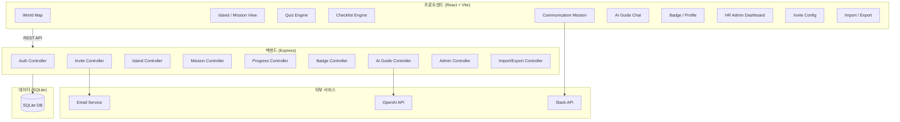
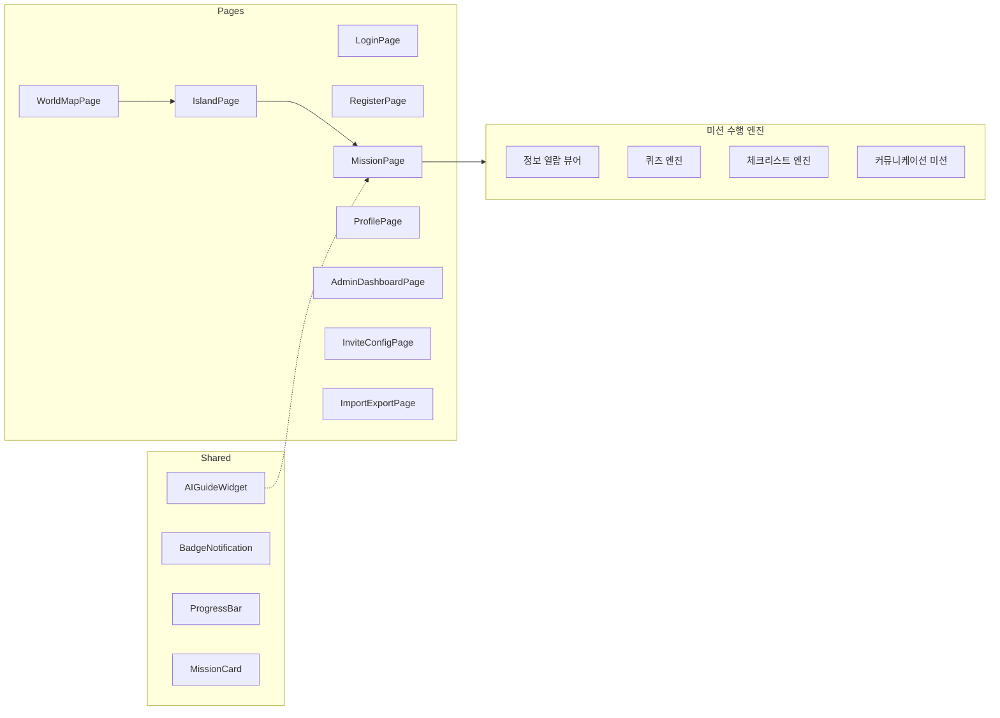
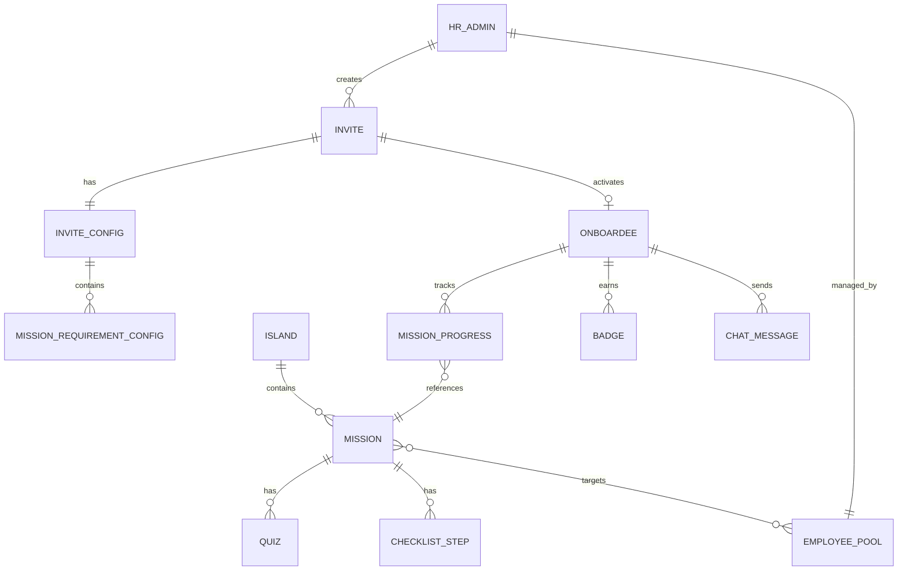

# 설계 문서: 게이미피케이션 기반 HR 온보딩 플랫폼 MVP

## 개요 (Overview)

게이미피케이션 기반 HR 온보딩 플랫폼은 신규 입사자가 회사의 각 본부(Island)를 탐험하며 미션을 수행하고, 뱃지를 획득하는 방식으로 온보딩을 진행하는 웹 애플리케이션이다.

기존 프로토타입(React 18 + Vite)을 기반으로 확장하며, 백엔드는 Node.js + Express + SQLite로 MVP를 구성한다. AI_Guide는 OpenAI API를 활용하고, 마크다운 파싱은 `unified`/`remark` 생태계를 사용한다.

### 핵심 설계 결정

| 결정 사항 | 선택 | 근거 |
|-----------|------|------|
| 프론트엔드 | React 18 + Vite | 기존 프로토타입 유지 |
| 백엔드 | Node.js + Express | 프론트엔드와 동일 언어, MVP 빠른 개발 |
| 데이터베이스 | SQLite (better-sqlite3) | MVP 단계에서 별도 DB 서버 불필요, 단일 파일 배포 |
| 인증 | JWT + 초대 링크 토큰 | 세션 관리 간소화, 초대 기반 가입 흐름에 적합 |
| AI_Guide | OpenAI Chat Completions API | 컨텍스트 기반 대화에 최적화 |
| 마크다운 파싱 | unified + remark | 라운드트립 보장이 가능한 AST 기반 파싱 |
| 파일 업로드 | multer + 로컬 스토리지 | MVP 단계 간소화, 추후 S3 전환 가능 |
| 테스트 | Vitest + fast-check | Vite 생태계 호환, 프로퍼티 기반 테스트 지원 |

---

## 아키텍처 (Architecture)

### 시스템 구조



### 계층 구조

```
┌─────────────────────────────────────────────┐
│  Presentation Layer (React Components)       │
├─────────────────────────────────────────────┤
│  API Layer (REST Endpoints)                  │
├─────────────────────────────────────────────┤
│  Service Layer (Business Logic)              │
├─────────────────────────────────────────────┤
│  Repository Layer (Data Access)              │
├─────────────────────────────────────────────┤
│  Data Layer (SQLite)                         │
└─────────────────────────────────────────────┘
```

---

## 컴포넌트 및 인터페이스 (Components and Interfaces)

### 백엔드 API 엔드포인트

#### 인증 및 초대

```
POST   /api/invites                 # 초대 링크 생성 (HR_Admin)
GET    /api/invites/:token          # 초대 링크 유효성 검증
POST   /api/auth/register           # 초대 기반 계정 생성
POST   /api/auth/login              # 로그인
```

#### Island 및 Mission 관리

```
GET    /api/islands                  # Island 목록 조회
GET    /api/islands/:id/missions     # Island별 미션 목록 (Onboardee용, Mission_Requirement 포함)
POST   /api/admin/islands/:id/missions       # 미션 추가 (HR_Admin)
PUT    /api/admin/missions/:id               # 미션 수정 (HR_Admin)
DELETE /api/admin/missions/:id               # 미션 비활성화 (HR_Admin)
```

#### 미션 수행

```
POST   /api/missions/:id/start      # 미션 시작
POST   /api/missions/:id/complete   # 미션 완료
PUT    /api/missions/:id/progress   # 미션 진행 상태 업데이트 (체크리스트 등)
POST   /api/missions/:id/quiz-answer # 퀴즈 답변 제출
POST   /api/missions/:id/upload     # 커뮤니케이션 미션 결과물 업로드
```

#### 뱃지 및 프로필

```
GET    /api/badges                   # 획득한 뱃지 목록
GET    /api/profile                  # 프로필 및 전체 진행 현황
```

#### AI Guide

```
POST   /api/ai-guide/chat           # AI Guide 대화
GET    /api/ai-guide/history        # 대화 이력 조회
```

#### HR Admin 대시보드

```
GET    /api/admin/dashboard          # 전체 Onboardee 현황
GET    /api/admin/onboardees/:id     # 특정 Onboardee 상세 진행 현황
POST   /api/admin/onboardees/:id/nudge  # 독려 알림 발송
GET    /api/admin/employee-pool      # Employee Pool 조회
POST   /api/admin/employee-pool      # Employee Pool 등록
```

#### 콘텐츠 임포트/익스포트

```
POST   /api/admin/import             # 마크다운 파일 임포트
GET    /api/admin/export/:missionId  # 미션 콘텐츠 마크다운 익스포트
```

### 프론트엔드 주요 컴포넌트



### 서비스 레이어 인터페이스

```typescript
// InviteService
interface InviteService {
  createInvite(email: string, department: string, config: InviteConfig): Promise<InviteToken>
  validateToken(token: string): Promise<InviteValidation>
  markUsed(token: string): Promise<void>
}

// MissionService
interface MissionService {
  getMissionsForOnboardee(onboardeeId: string, islandId: string): Promise<MissionWithRequirement[]>
  startMission(onboardeeId: string, missionId: string): Promise<MissionProgress>
  completeMission(onboardeeId: string, missionId: string): Promise<CompletionResult>
  updateProgress(onboardeeId: string, missionId: string, data: ProgressData): Promise<MissionProgress>
  submitQuizAnswer(onboardeeId: string, missionId: string, quizId: string, answer: any): Promise<QuizResult>
}

// BadgeService
interface BadgeService {
  checkAndAwardBadge(onboardeeId: string, islandId: string): Promise<Badge | null>
  getBadges(onboardeeId: string): Promise<Badge[]>
}

// AIGuideService
interface AIGuideService {
  chat(onboardeeId: string, message: string, context: AIContext): Promise<AIResponse>
  getHistory(onboardeeId: string): Promise<ChatMessage[]>
  escalateToHR(onboardeeId: string, question: string): Promise<void>
}

// ContentService (Import/Export)
interface ContentService {
  importMarkdown(markdown: string): MissionContent
  exportMarkdown(missionContent: MissionContent): string
}
```

---

## 데이터 모델 (Data Models)

### ER 다이어그램



### 테이블 정의

#### users

| 컬럼 | 타입 | 설명 |
|------|------|------|
| id | TEXT (UUID) | PK |
| email | TEXT | 이메일 (UNIQUE) |
| name | TEXT | 이름 |
| password_hash | TEXT | 비밀번호 해시 |
| role | TEXT | 'onboardee' \| 'hr_admin' |
| department | TEXT | 소속 본부 |
| created_at | DATETIME | 생성일시 |

#### invites

| 컬럼 | 타입 | 설명 |
|------|------|------|
| id | TEXT (UUID) | PK |
| token | TEXT | 초대 토큰 (UNIQUE) |
| email | TEXT | 대상 이메일 |
| department | TEXT | 소속 본부 |
| created_by | TEXT (FK) | HR_Admin ID |
| used | BOOLEAN | 사용 여부 |
| expires_at | DATETIME | 만료일시 (생성 후 7일) |
| created_at | DATETIME | 생성일시 |

#### invite_configs

| 컬럼 | 타입 | 설명 |
|------|------|------|
| id | TEXT (UUID) | PK |
| invite_id | TEXT (FK) | 초대 ID |
| mission_id | TEXT (FK) | 미션 ID |
| requirement | TEXT | 'required' \| 'optional' |

#### islands

| 컬럼 | 타입 | 설명 |
|------|------|------|
| id | TEXT (UUID) | PK |
| name | TEXT | 섬 이름 |
| slug | TEXT | URL 슬러그 (UNIQUE) |
| description | TEXT | 설명 |
| icon | TEXT | 아이콘 |
| sort_order | INTEGER | 정렬 순서 |

#### missions

| 컬럼 | 타입 | 설명 |
|------|------|------|
| id | TEXT (UUID) | PK |
| island_id | TEXT (FK) | 소속 Island |
| title | TEXT | 미션 제목 |
| description | TEXT | 미션 설명 |
| type | TEXT | 'info' \| 'quiz' \| 'task' \| 'communication' |
| content | TEXT (JSON) | 미션 콘텐츠 (유형별 구조 상이) |
| sort_order | INTEGER | 정렬 순서 |
| is_active | BOOLEAN | 활성 여부 |
| created_at | DATETIME | 생성일시 |
| updated_at | DATETIME | 수정일시 |

#### mission_content JSON 구조 (type별)

```json
// type: "info" — 정보 열람
{
  "blocks": [
    { "type": "text", "body": "마크다운 텍스트" },
    { "type": "image", "url": "/uploads/img.png", "alt": "설명" },
    { "type": "video", "url": "https://..." }
  ]
}

// type: "quiz" — 퀴즈
{
  "quizzes": [
    {
      "id": "q1",
      "question": "질문 텍스트",
      "options": ["A", "B", "C", "D"],
      "correctAnswer": 1,
      "explanation": "해설 텍스트"
    }
  ]
}

// type: "task" — 실무 수행 (체크리스트)
{
  "steps": [
    { "id": "s1", "title": "그룹웨어 가입", "description": "상세 안내..." },
    { "id": "s2", "title": "프린터 연결", "description": "상세 안내..." }
  ]
}

// type: "communication" — 커뮤니케이션
{
  "targetEmployeeId": "emp-uuid",
  "activityType": "photo_upload" | "quiz" | "keyword",
  "activityDescription": "활동 안내 텍스트",
  "requiredEvidence": "photo" | "text"
}
```

#### quizzes

| 컬럼 | 타입 | 설명 |
|------|------|------|
| id | TEXT (UUID) | PK |
| mission_id | TEXT (FK) | 소속 미션 |
| question | TEXT | 질문 |
| options | TEXT (JSON) | 선택지 배열 |
| correct_answer | INTEGER | 정답 인덱스 |
| explanation | TEXT | 해설 |
| sort_order | INTEGER | 정렬 순서 |

#### checklist_steps

| 컬럼 | 타입 | 설명 |
|------|------|------|
| id | TEXT (UUID) | PK |
| mission_id | TEXT (FK) | 소속 미션 |
| title | TEXT | 단계 제목 |
| description | TEXT | 단계 설명 |
| sort_order | INTEGER | 정렬 순서 |

#### mission_progress

| 컬럼 | 타입 | 설명 |
|------|------|------|
| id | TEXT (UUID) | PK |
| onboardee_id | TEXT (FK) | Onboardee ID |
| mission_id | TEXT (FK) | 미션 ID |
| status | TEXT | 'not_started' \| 'in_progress' \| 'completed' |
| requirement | TEXT | 'required' \| 'optional' (Invite_Config에서 복사) |
| progress_data | TEXT (JSON) | 유형별 진행 데이터 |
| started_at | DATETIME | 시작일시 |
| completed_at | DATETIME | 완료일시 |
| updated_at | DATETIME | 최종 업데이트 |

#### progress_data JSON 구조 (type별)

```json
// quiz 미션
{ "answers": { "q1": { "selected": 1, "correct": true, "attempts": 1 } } }

// task 미션 (체크리스트)
{ "completedSteps": ["s1", "s2"] }

// communication 미션
{ "evidenceUrl": "/uploads/photo.jpg", "submittedAt": "2024-..." }
```

#### badges

| 컬럼 | 타입 | 설명 |
|------|------|------|
| id | TEXT (UUID) | PK |
| onboardee_id | TEXT (FK) | Onboardee ID |
| island_id | TEXT (FK) | Island ID |
| name | TEXT | 뱃지 이름 |
| earned_at | DATETIME | 획득일시 |

#### employee_pool

| 컬럼 | 타입 | 설명 |
|------|------|------|
| id | TEXT (UUID) | PK |
| name | TEXT | 직원 이름 |
| team | TEXT | 소속 팀 |
| position | TEXT | 직책 |
| email | TEXT | 이메일 |
| slack_id | TEXT | 슬랙 ID (nullable) |

#### chat_messages

| 컬럼 | 타입 | 설명 |
|------|------|------|
| id | TEXT (UUID) | PK |
| onboardee_id | TEXT (FK) | Onboardee ID |
| role | TEXT | 'user' \| 'assistant' |
| content | TEXT | 메시지 내용 |
| context_island_id | TEXT (FK, nullable) | 대화 시점의 Island |
| context_mission_id | TEXT (FK, nullable) | 대화 시점의 Mission |
| created_at | DATETIME | 생성일시 |

### 마크다운 임포트/익스포트 형식

미션 콘텐츠의 마크다운 라운드트립을 위한 표준 형식:

```markdown
---
title: "미션 제목"
type: "info | quiz | task | communication"
island: "island-slug"
---

# 미션 제목

## 콘텐츠

본문 텍스트...


## 퀴즈

### Q1: 질문 텍스트
- [ ] 선택지 A
- [x] 선택지 B (정답)
- [ ] 선택지 C

> 해설: 해설 텍스트

## 체크리스트

- [ ] 단계 1: 설명
- [ ] 단계 2: 설명
```

파싱 규칙:
- YAML frontmatter로 메타데이터 추출
- `## 퀴즈` 섹션 하위의 `### Q{n}:` 패턴으로 퀴즈 파싱
- `- [x]`는 정답, `- [ ]`는 오답 선택지
- `> 해설:` 블록쿼트로 해설 추출
- `## 체크리스트` 섹션의 `- [ ]` 항목으로 체크리스트 단계 파싱


---

## 정확성 속성 (Correctness Properties)

*정확성 속성(Property)이란 시스템의 모든 유효한 실행에서 참이어야 하는 특성 또는 동작을 의미한다. 사람이 읽을 수 있는 명세와 기계가 검증할 수 있는 정확성 보장 사이의 다리 역할을 한다.*

### Property 1: 초대 토큰 고유성

*For all* 이메일과 본부 조합에 대해, 초대 링크를 생성할 때마다 생성되는 토큰은 기존의 모든 토큰과 중복되지 않아야 한다.

**Validates: Requirements 1.1**

### Property 2: 초대 링크 만료 판정

*For all* 초대 링크에 대해, 생성 시점으로부터 7일이 경과한 토큰은 유효성 검증에서 실패해야 하고, 7일 이내의 미사용 토큰은 유효해야 한다.

**Validates: Requirements 1.5**

### Property 3: 사용된 초대 토큰 재사용 차단

*For all* 초대 토큰에 대해, 한 번 계정 생성에 사용된 토큰으로 다시 가입을 시도하면 거부되어야 하고, 기존 계정 데이터는 변경되지 않아야 한다.

**Validates: Requirements 1.6**

### Property 4: Invite_Config 저장 라운드트립

*For all* 유효한 Invite_Config(Island별 미션의 Required/Optional 설정)에 대해, 저장 후 다시 조회하면 동일한 설정이 반환되어야 한다.

**Validates: Requirements 1.3, 3.7**

### Property 5: Invite_Config → Onboardee 미션 설정 적용

*For all* Invite_Config와 해당 초대로 생성된 Onboardee에 대해, Onboardee의 미션 목록 조회 시 각 미션의 requirement 필드는 Invite_Config에서 지정한 값과 정확히 일치해야 한다.

**Validates: Requirements 1.7, 3.8**

### Property 6: Island 완료 판정

*For all* Island와 Onboardee에 대해, 해당 Island의 모든 Required 미션이 completed 상태이면 Island_Completion은 true이고, 하나라도 미완료이면 false여야 한다.

**Validates: Requirements 2.2, 2.5**

### Property 7: 미션 CRUD 라운드트립

*For all* 유효한 미션 데이터(제목, 설명, 유형)에 대해, Island에 추가한 후 조회하면 동일한 데이터가 반환되어야 한다.

**Validates: Requirements 3.2**

### Property 8: 미션 변경 시 기존 Progress 보존

*For all* 미션 수정 또는 삭제(비활성화)에 대해, 해당 미션을 이미 완료한 Onboardee의 Mission_Progress status는 'completed'로 유지되어야 한다.

**Validates: Requirements 3.3, 3.4**

### Property 9: 미션 완료 상태 전이

*For all* 미션 유형(정보 열람, 퀴즈, 실무 수행, 커뮤니케이션)에 대해, 해당 유형의 완료 조건을 충족하면 Mission_Progress status가 'completed'로 전이되어야 한다.

**Validates: Requirements 4.2, 5.3, 6.3**

### Property 10: 퀴즈 정오답 판정 및 재시도

*For all* 퀴즈와 답변에 대해, 정답 제출 시 correct=true가 반환되고, 오답 제출 시 correct=false가 반환되며, 동일 퀴즈에 2회 오답 후에는 정답과 해설이 표시되고 해당 퀴즈가 완료 처리되어야 한다.

**Validates: Requirements 4.4, 4.5**

### Property 11: 퀴즈 정답률 계산

*For all* 퀴즈 미션의 답변 세트에 대해, 계산된 정답률은 (첫 시도에서 정답인 퀴즈 수 / 전체 퀴즈 수)와 정확히 일치해야 한다.

**Validates: Requirements 4.6**

### Property 12: 체크리스트 진행 상태 라운드트립

*For all* 체크리스트 미션의 진행 상태에 대해, 완료된 단계를 저장한 후 다시 조회하면 동일한 completedSteps 목록이 반환되어야 한다.

**Validates: Requirements 5.2, 5.5**

### Property 13: 커뮤니케이션 미션 대상자 무결성

*For all* 커뮤니케이션 미션에 대해, 미션에 지정된 대상자 ID는 Employee_Pool에 존재해야 하며, 미션 시작 시 반환되는 대상자 정보(이름, 직책, 팀)는 Employee_Pool의 데이터와 일치해야 한다.

**Validates: Requirements 6.2, 6.5**

### Property 14: 커뮤니케이션 미션 결과물 필수 검증

*For all* 커뮤니케이션 미션에 대해, 결과물(사진, 퀴즈 답변, 키워드)이 업로드되지 않은 상태에서 완료를 시도하면 거부되어야 한다.

**Validates: Requirements 6.4**

### Property 15: Island 완료 시 뱃지 부여

*For all* Island와 Onboardee에 대해, Island의 모든 미션을 완료하면 해당 Island에 대응하는 Badge가 정확히 1개 부여되어야 하며, 중복 부여되지 않아야 한다.

**Validates: Requirements 7.2**

### Property 16: 뱃지 목록 정확성

*For all* Onboardee에 대해, 뱃지 목록 조회 시 각 뱃지에는 island_name과 earned_at이 포함되어야 하며, 실제 부여된 뱃지와 1:1로 대응해야 한다.

**Validates: Requirements 7.4, 7.5**

### Property 17: AI Guide 컨텍스트 포함

*For all* AI Guide 대화 요청에 대해, 시스템이 OpenAI API에 전달하는 프롬프트에는 현재 진행 중인 Island ID와 Mission ID가 포함되어야 한다.

**Validates: Requirements 8.2**

### Property 18: 미션 추천 로직

*For all* Onboardee의 미완료 미션 집합에 대해, 추천 결과는 Required 미션을 Optional 미션보다 우선하고, sort_order가 낮은 미션을 먼저 반환해야 한다.

**Validates: Requirements 8.3**

### Property 19: 대화 이력 순서 보존

*For all* AI Guide 대화 메시지 시퀀스에 대해, 저장 후 조회하면 생성 시간 순서대로 동일한 메시지가 반환되어야 한다.

**Validates: Requirements 8.5**

### Property 20: 대시보드 완료율 계산

*For all* Onboardee와 해당 미션 집합에 대해, 대시보드에 표시되는 완료율은 (completed 상태인 미션 수 / 전체 미션 수 × 100)과 정확히 일치해야 한다.

**Validates: Requirements 9.1**

### Property 21: 지연 상태 판정

*For all* Onboardee에 대해, 마지막 Mission_Progress 업데이트로부터 3일(72시간) 이상 경과하고 전체 미션이 미완료이면 지연 상태로 표시되어야 한다.

**Validates: Requirements 9.3**

### Property 22: Island별 평균 완료 소요 시간 계산

*For all* Island에 대해, 대시보드에 표시되는 평균 완료 소요 시간은 (해당 Island를 완료한 각 Onboardee의 소요 시간 합 / 완료한 Onboardee 수)와 일치해야 한다.

**Validates: Requirements 9.5**

### Property 23: 마크다운 라운드트립

*For all* 유효한 Mission 콘텐츠 객체에 대해, 마크다운으로 내보낸(export) 후 다시 임포트(import)하면 원본과 동일한 Mission 콘텐츠 객체가 생성되어야 한다.

**Validates: Requirements 10.1, 10.3, 10.4**

### Property 24: 잘못된 마크다운 에러 처리

*For all* 유효하지 않은 마크다운 입력(필수 frontmatter 누락, 잘못된 퀴즈 형식 등)에 대해, 파싱 시 에러가 발생하고 파싱 실패 원인을 포함한 에러 메시지가 반환되어야 한다.

**Validates: Requirements 10.2**

---

## 에러 처리 (Error Handling)

### 에러 분류 및 처리 전략

| 에러 유형 | HTTP 코드 | 처리 방식 |
|-----------|-----------|-----------|
| 인증 실패 (토큰 만료/무효) | 401 | 로그인 페이지로 리다이렉트 |
| 권한 부족 (Onboardee가 Admin API 접근) | 403 | 권한 부족 메시지 표시 |
| 초대 링크 만료 | 410 | 만료 안내 + HR 담당자 연락 안내 |
| 초대 링크 중복 사용 | 409 | 이미 가입된 계정 안내 |
| 미션 완료 조건 미충족 | 422 | 누락된 조건 상세 안내 |
| 파일 업로드 실패 | 400 | 허용 형식/크기 안내 |
| 마크다운 파싱 실패 | 422 | 파싱 실패 원인 상세 메시지 |
| Island 미션 개수 초과 (20개) | 422 | 최대 개수 초과 안내 |
| AI Guide API 실패 | 503 | 일시적 오류 안내 + 재시도 버튼 |
| DB 에러 | 500 | 일반 서버 오류 메시지 (상세 로그는 서버에만) |

### 에러 응답 형식

```json
{
  "error": {
    "code": "INVITE_EXPIRED",
    "message": "초대 링크가 만료되었습니다. HR 담당자에게 새 초대를 요청해주세요.",
    "details": { "expiredAt": "2024-01-15T00:00:00Z" }
  }
}
```

### 프론트엔드 에러 처리

- API 호출 실패 시 토스트 알림으로 사용자에게 안내
- 네트워크 오류 시 자동 재시도 (최대 3회, 지수 백오프)
- 401 응답 시 자동 로그아웃 및 로그인 페이지 이동
- 미션 진행 중 오류 시 로컬 상태 보존 후 재시도 유도

---

## 테스트 전략 (Testing Strategy)

### 이중 테스트 접근법

본 프로젝트는 단위 테스트와 프로퍼티 기반 테스트를 병행한다.

- **단위 테스트 (Vitest)**: 구체적인 예시, 엣지 케이스, 에러 조건 검증
- **프로퍼티 기반 테스트 (Vitest + fast-check)**: 모든 입력에 대한 보편적 속성 검증

두 접근법은 상호 보완적이다. 단위 테스트는 구체적인 버그를 잡고, 프로퍼티 테스트는 일반적인 정확성을 검증한다.

### 테스트 도구

| 도구 | 용도 |
|------|------|
| Vitest | 테스트 러너 및 단위 테스트 |
| fast-check | 프로퍼티 기반 테스트 라이브러리 |
| supertest | API 엔드포인트 통합 테스트 |

### 프로퍼티 기반 테스트 설정

- 각 프로퍼티 테스트는 최소 100회 반복 실행
- 각 테스트에 설계 문서의 Property 번호를 태그로 포함
- 태그 형식: `Feature: gamified-hr-onboarding, Property {number}: {property_text}`
- 각 정확성 속성은 하나의 프로퍼티 기반 테스트로 구현

### 테스트 범위

#### 프로퍼티 기반 테스트 (Property 1~24)

| Property | 테스트 대상 | 생성기 |
|----------|------------|--------|
| 1 | InviteService.createInvite | 임의의 이메일 + 본부 |
| 2 | InviteService.validateToken | 임의의 토큰 + 시간 오프셋 |
| 3 | InviteService.validateToken | 사용된 토큰 |
| 4 | InviteConfigRepository CRUD | 임의의 InviteConfig |
| 5 | MissionService.getMissionsForOnboardee | 임의의 InviteConfig + Onboardee |
| 6 | IslandCompletionService.check | 임의의 Island + MissionProgress 집합 |
| 7 | MissionRepository CRUD | 임의의 Mission 데이터 |
| 8 | MissionService.update/deactivate | 임의의 미션 + 기존 Progress |
| 9 | MissionService.complete | 임의의 미션 유형 + 완료 조건 |
| 10 | QuizEngine.submitAnswer | 임의의 퀴즈 + 정답/오답 |
| 11 | QuizEngine.calculateScore | 임의의 답변 세트 |
| 12 | ChecklistProgressRepository | 임의의 completedSteps |
| 13 | CommunicationMissionService | 임의의 미션 + Employee_Pool |
| 14 | CommunicationMissionService.complete | 결과물 없는 완료 시도 |
| 15 | BadgeService.checkAndAward | 임의의 Island + 완료 상태 |
| 16 | BadgeService.getBadges | 임의의 뱃지 집합 |
| 17 | AIGuideService.buildPrompt | 임의의 컨텍스트 |
| 18 | MissionRecommendationService | 임의의 미완료 미션 집합 |
| 19 | ChatMessageRepository | 임의의 메시지 시퀀스 |
| 20 | DashboardService.getCompletionRate | 임의의 Progress 집합 |
| 21 | DashboardService.getDelayedOnboardees | 임의의 Onboardee + 시간 |
| 22 | DashboardService.getAvgCompletionTime | 임의의 완료 시간 집합 |
| 23 | ContentService.export → import | 임의의 MissionContent |
| 24 | ContentService.import | 잘못된 마크다운 |

#### 단위 테스트 (예시 및 엣지 케이스)

- 기본 4개 Island 존재 확인 (요구사항 3.1)
- Island 미완료 시 HR 섬 강조 (요구사항 2.3)
- 모든 뱃지 획득 시 완료 판정 (요구사항 7.3)
- 슬랙 알림 발송 모킹 (요구사항 6.6)
- HR Admin 독려 이메일 발송 모킹 (요구사항 9.4)
- AI Guide 에스컬레이션 (요구사항 8.4)
- Island당 미션 1~20개 경계값 (요구사항 3.5)
- 퀴즈 순서 정렬 확인 (요구사항 4.3)